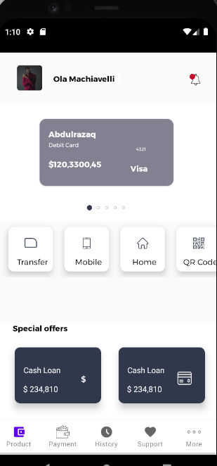

# Payment-App-design-with-splashScreen
A modern payment UI design with an easy to understand user interface

## Development

Clads Codebase is designed to enable easy flow and collaboration among android native developers of all experiences, yet leveraging latest standards, architecture and best practces. Below and many more are the technologies that would be used. 

- [CardView](https://developer.android.com/jetpack/androidx/releases/cardview/)
- [ViewPager 2](https://developer.android.com/jetpack/androidx/releases/viewpager2)
- [Recyclerview](https://developer.android.com/jetpack/androidx/releases/recyclerview)
- [Bottom navigation view](https://material.io/components/bottom-navigation/android)
- [Kotlin](https://kotlinlang.org/)
- [Animated Splash screen with lottiefiles](https://lottiefiles.com/)

- And many more

